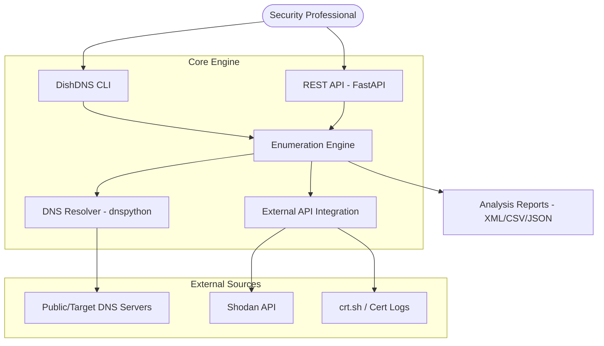
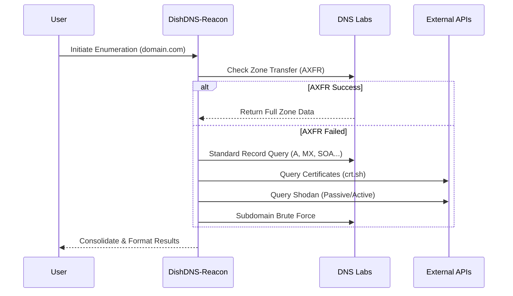

# 🌌 DishDNS-Reacon

> **The definitive DNS Enumeration & Reconnaissance suite, custom-built by Dishanth.**

[](https://www.python.org/downloads/)
[](https://www.gnu.org/licenses/old-licenses/gpl-2.0.en.html)
[](https://github.com/dishanthca/DishDNS-Reacon)

---

## 🚀 Overview

**DishDNS-Reacon** is a state-of-the-art DNS reconnaissance engine designed for security professionals and network administrators. It provides a comprehensive toolkit for mapping infrastructure, discovering hidden subdomains, and auditing DNS security configurations.

### 🛠️ Key Capabilities

| Feature | Description |
| :--- | :--- |
| **Zone Transfers** | Automated AXFR record checks for all NS servers. |
| **General Enumeration** | Detailed lookup of MX, SOA, NS, A, AAAA, SPF, and TXT records. |
| **SRV Discovery** | Targeted enumeration of common service records. |
| **TLD Expansion** | Brute-force discovery across global top-level domains. |
| **Wildcard Detection** | Intelligent resolution checks for wildcard DNS. |
| **Brute Force** | High-performance subdomain discovery using custom wordlists. |
| **Reverse Lookup** | PTR record auditing for entire IP ranges or CIDRs. |
| **Cache Snooping** | Non-intrusive checking of remote DNS caches. |
| **Shodan Expansion** | Native Shodan integration for deep netblock reconnaissance. |

---

## 📊 System Architecture



---

## 🔍 Reconnaissance Workflow



---

## ⚙️ Installation

### 1. Requirements
Ensure you have **Python 3.12+** installed.

### 2. Quick Setup (Recommended: `uv`)
Install dependencies and prepare the environment in one command:
```bash
git clone https://github.com/dishanthca/DishDNS-Reacon.git
cd DishDNS-Reacon
uv sync
```

### 3. Running the Engine
```bash
# General CLI usage
uv run dishdns_reacon -d example.com -t std

# Start REST API
uv run restdishdns_reacon
```

---

## 🛡️ Shodan Integration

DishDNS-Reacon leverages Shodan to expand discovered netblocks from SPF and WHOIS data.

```bash
# Passive Shodan enrichment
uv run dishdns_reacon -d example.com -t std -s -w --shodan --shodan-key "YOUR_KEY"

# Active validation of hosts
uv run dishdns_reacon -d example.com -t std -s -w --shodan --shodan-active
```

---

## 🌐 REST API Usage

The REST API provides a programatic way to integrate reconnaissance into your own workflows.

```bash
# Display capabilities
curl -s http://127.0.0.1:5000/capabilities

# Perform general enumeration
curl -s "http://127.0.0.1:5000/general_enum?domain=example.com&do_spf=true"
```

---

## ✍️ Author & Credits

Designed and maintained by **Dishanth**.

> [!TIP]
> This tool is a complete evolution of standard DNS reconnaissance methodologies, optimized for speed, accuracy, and ease of use.

---

## 📄 License
Licensed under the **GPL v2**. See [LICENSE](LICENSE) for details.
